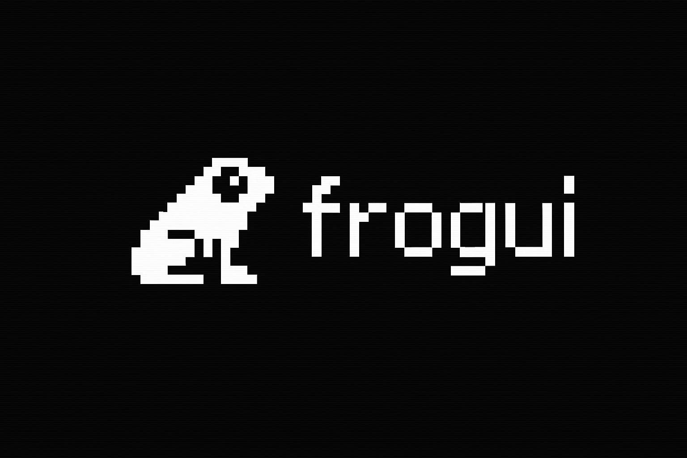

# FrogUI - Minimalistic Launcher for SF2000/GB300 consoles

FrogUI is a libretro-based launcher that provides a simple, clean interface for browsing and launching games on SF2000/GB300 handhelds.

📦 **[Installation Guide](INSTALLATION.md)** - Start here to install FrogUI on your device

⬇️ **[Latest Release](https://github.com/tzubertowski/FrogUI/releases)** - Download the latest version

📖 **[How to Use Guide](HOW_TO_USE.md)** - Complete setup and usage instructions

## Features

- **Hotkeys for Save State, Load and state index change**: Quick access to save states directly from the file browser
- **Thumbnails**: Display game preview images in RGB565 format
- **Multiple themes**: Choose from various color schemes to customize your experience
- **Ease of use, no additional scripts required, just drag and drop**: Simple installation and ROM management

## How It Works

### Directory Navigation
- When you start FrogUI, it shows only the folders in `/mnt/sda1/ROMS`
- Use **D-Pad Up/Down** to select a folder
- Press **A** to enter a folder
- Inside a folder, you'll see both subdirectories and game files
- Press **B** to go back to the parent directory
- Press **Select** to access settings:
  - **Main menu (folders)** + Select = Multicore/FrogUI settings
  - **Inside folder** + Select = Core settings for that system

### Launching Games
- Select a game file and press **A** to launch it directly
- FrogUI automatically determines which core to use based on the folder name
- The game boots immediately with the appropriate emulator

## For Developers

🔧 **[Development Guide](DEVELOPMENT.md)** - Building from source, technical details, and contribution guidelines

## License

FrogUI is licensed under [CC BY-NC-SA 4.0](https://creativecommons.org/licenses/by-nc-sa/4.0/). See [LICENSE](LICENSE) for full details.

**Non-Commercial Use Only** - You may not sell FrogUI or bundle it with devices for sale without explicit permission. For commercial licensing inquiries, contact the project maintainers.

## Credits

- Inspired by MinUI's clean interface design
- Built on the SF2000/GB300 multicore framework
- Uses the custom SF2000 filesystem implementation
